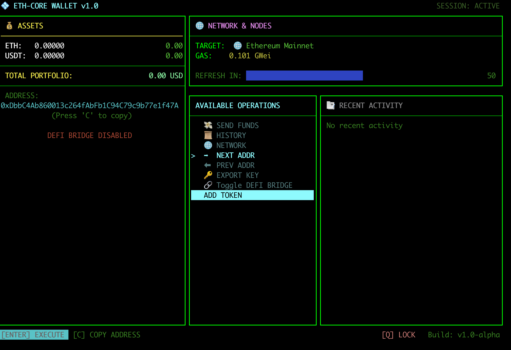

<div align="center">

# 💠 ETH Core Wallet

**A self-contained, terminal-native Ethereum wallet — and DeFi bridge — written entirely in modern C++**

*Mnemonic → HD keys → signed transactions → on-chain broadcast → dApp connectivity. No `web3.js`. No `ethers.js`. Every cryptographic layer built by hand.*

</div>

---

<p align="center">
  
</p>


---

## ⚠️ Project status

> **Alpha — actively developed.** Core wallet, signing, transaction, and dApp-bridge flows all work end-to-end and have been exercised live on Sepolia. Interfaces, on-disk formats, and screens may change without notice. **Do not load real funds** until an independent security review has taken place — see [Security notice](#-security-notice).

---

## 📖 Table of contents

- [Why this exists](#-why-this-exists)
- [Feature overview](#-feature-overview)
- [Architecture](#-architecture)
- [The dApp bridge, in depth](#-the-dapp-bridge-in-depth)
- [Tech stack](#-tech-stack)
- [Getting started](#-getting-started)
- [Project layout](#-project-layout)
- [How signing works](#-how-signing-works)
- [Testing](#-testing)
- [Roadmap](#-roadmap)
- [Security notice](#-security-notice)
- [License](#-license)

---

## 🎯 Why this exists

Every mainstream wallet — MetaMask, Rabby, Trust — sits on top of `web3.js`/`ethers.js`, which quietly does the cryptography for you. This project takes the opposite stance: **every layer between "type a password" and "confirmed on-chain" is implemented from first principles**, with no wallet SDK anywhere in the dependency tree.

That includes:

- BIP-39 mnemonic generation and checksum verification
- BIP-32 hierarchical key derivation over `secp256k1`
- RLP encoding for EIP-155 legacy transactions
- ECDSA signing with public-key recovery, straight against `libsecp256k1`
- **EIP-712 typed-data hashing** — a from-scratch encoder (domain separator, `hashStruct`, nested types, arrays) built on a self-contained Keccak-256 implementation
- A **local EIP-1193 / EIP-6963 provider bridge**, so dApps like Uniswap can discover and talk to this wallet directly from the browser — no MetaMask in the middle

If you've ever wondered what actually happens between clicking "Connect Wallet" and a transaction landing in a block, this project answers it in ~10k lines of C++ instead of hiding it behind an npm package.

---

## ✨ Feature overview

### 🔐 Wallet & key management
- BIP-39 mnemonic generation (128 / 256-bit entropy, 12 or 24 words) with optional user-supplied extra entropy mixed via SHA-256
- Optional BIP-39 passphrase ("25th word") for hidden wallets
- Custom or standard (`m/44'/60'/0'/0/0`) HD derivation paths, with forward/backward address cycling
- `secp256k1`-backed key derivation and EIP-55 checksum address generation
- Encrypted local keystore — `AES-256-CTR` + `PBKDF2-HMAC-SHA512` + Keccak-256 MAC integrity check
- Password-gated unlock with limited attempts and destructive auto-wipe on repeated failure
- Hardened memory: a custom `mlock`-backed allocator + `OPENSSL_cleanse` wipe every private key, mnemonic, and password buffer on destruction

### 🌐 Multi-chain, explorer-aware
- Ethereum Mainnet, Polygon PoS, Arbitrum One, Optimism, Sepolia — each with its own RPC prefix **and** block-explorer API endpoint baked into `NetworkConfig`
- Instant network switching with full state invalidation across every manager (no cross-chain data bleed — see [Architecture](#-architecture))
- Per-chain CoinGecko platform-ID mapping for future price/metadata lookups

### 💰 Balances, tokens & pricing
- Concurrent native + ERC-20 balance fetching (`eth_getBalance` / `eth_call → balanceOf`) via `std::async` fan-out
- **Add-any-token flow**: paste a contract address, and the wallet calls `decimals()` / `symbol()` / `name()` directly on-chain — including the legacy `bytes32`-return fallback older tokens (like mainnet USDT) rely on
- Lock-free, thread-safe balance snapshots via atomic `shared_ptr` (`std::atomic<std::shared_ptr<T>>`, with a portable `atomic_load/store` fallback)
- Pluggable pricing pipeline designed to prefer on-chain oracle data (Chainlink feeds / Feed Registry) over centralized APIs, with CoinGecko/CryptoCompare as fallback only

### 📤 Transactions
- Native ETH and ERC-20 transfers, manually ABI-encoded (`transfer(address,uint256)`)
- EIP-155-signed legacy transactions, replay-protected and chain-ID aware
- Automatic pending-aware nonce management
- Gas presets — Slow / Normal / Fast / fully custom gwei + gas-limit override
- `eth_estimateGas` with a configurable safety margin
- Live status tracking (pending → confirmed / reverted) via `eth_getTransactionReceipt` polling, generation-tagged so stale polls from a previous network can never overwrite fresh state
- **Speed up** and **cancel** for stuck transactions — same-nonce replacement with bumped gas price
- Full confirm flow: form → preview → password re-authentication → broadcast → live animated status

### 📜 History
- Combined incoming/outgoing transfer history (native + ERC-20) sourced from the active network's own block-explorer API — no hardcoded third-party indexer
- Incremental fetching from the last known block, with client-side de-duplication by hash
- Scrollable, paginated history view (arrow keys + mouse wheel)

### 🔌 DeFi & dApp connectivity — the local RPC bridge
This is the headline feature: **you can connect this wallet to real dApps in a real browser**, exactly like MetaMask, without MetaMask.

- An embedded HTTP JSON-RPC server (`cpp-httplib`), bound strictly to `127.0.0.1`
- Implements the exact surface dApps expect: `eth_requestAccounts`, `eth_accounts`, `eth_chainId`, `net_version`, `eth_sendTransaction`, `personal_sign`, `eth_signTypedData_v4` — everything else is transparently proxied to the active RPC provider
- A companion browser extension announces the wallet via **EIP-6963** (`window.dispatchEvent("eip6963:announceProvider")`), so it shows up natively in Uniswap's (and any modern dApp's) wallet picker — not bolted on as a fake MetaMask
- Every signature-producing request **blocks on a condition variable** until a human approves it inside the terminal UI — origin domain, method, and decoded parameters are always shown before signing
- Full **EIP-712** support for `eth_signTypedData_v4` (Permit, Permit2, limit orders, etc.), built on a standalone typed-data hasher — arbitrary nested structs and arrays, not a hardcoded single schema
- `personal_sign` implemented per EIP-191 (`\x19Ethereum Signed Message:\n<len><msg>`)

### 🖥️ Terminal UI — [FTXUI](https://github.com/ArthurSonzogni/FTXUI)
- Full-screen, keyboard **and mouse**-driven interface — no external terminal multiplexer required
- Live-refreshing balance/gas panels with a visual countdown to the next poll
- Animated spinner during in-flight confirmation waits
- Cross-platform clipboard copy for address / private key (`pbcopy` / `xclip`, `xsel`, `wl-copy` / `clip`)
- Every destructive or high-stakes action — revealing a key, wiping a mnemonic, sending funds, approving a dApp request — is gated behind an explicit, hard-to-misclick confirmation screen

---

## 🏗 Architecture

```
┌──────────────────────────────────────────────────────────────────┐
│                          CLI  (FTXUI)                              │
│  Dashboard · Send flow · History · Network · Add Token · dApp UI   │
└──────────────────────────────┬─────────────────────────────────────┘
                                │ IWalletActions (pure interface)
┌──────────────────────────────▼─────────────────────────────────────┐
│                          UserInterface                               │
│         orchestrates Wallet + BlockchainClient + RpcBridge            │
└───────┬────────────────────────────────┬──────────────────┬──────────┘
        │                                │                  │
┌───────▼────────┐             ┌─────────▼──────────┐  ┌────▼─────────────┐
│     Wallet       │             │   BlockchainClient   │  │    RpcBridge      │
│ mnemonic/HD keys │             │  per-chain RPC facade │  │ 127.0.0.1 :8989   │
│ keystore crypto  │             └─┬───┬───┬───┬───┬────┘  │ EIP-1193 server   │
└──────────────────┘               │   │   │   │   │       └────────┬──────────┘
                    ┌───────────────┘   │   │   │   └───────────┐   │ blocks on
             ┌──────▼─────┐  ┌──────────▼─┐┌▼─────────┐  ┌──────▼─▼──────────┐
             │BalanceMgr  │  │GasManager  ││HistoryMgr │  │TransactionMgr /    │
             │(async poll)│  │(async poll)││(async poll)│  │TxStatusMgr /       │
             └────────────┘  └────────────┘└────────────┘  │TokensMetadata      │
                                                             └────────────────────┘
```

**Design decisions that matter:**

- **Every data source is a polling `Manager`, not a callback.** `Balance`, `Gas`, `History`, and `TxStatus` all derive from a shared base exposing `request()` / `update()` / `can_request()`. The UI thread calls `update()` every frame; the actual network I/O runs on a detached `std::async` worker, picked up non-blockingly via `future::wait_for(0ms)`.
- **Generation counters kill stale data at the source.** Every manager tags in-flight requests with a `generation` number. Switching networks bumps it — so a slow Mainnet gas-price fetch can *never* silently overwrite a fresh Sepolia read that started later.
- **Atomic `shared_ptr` snapshots, not locks.** Balances and history publish through `std::atomic<std::shared_ptr<T>>` (falling back to `std::atomic_load/store` when the STL doesn't yet support atomic `shared_ptr`), giving the render thread a consistent, tear-free view without ever blocking.
- **`RpcBridge` lives beside `Wallet`, not inside `BlockchainClient`.** `BlockchainClient` stays a pure, UI-agnostic network facade. `RpcBridge` needs to pause an HTTP request and wait for a human decision — that's an orchestration concern, so it's owned by `UserInterface`, wired up with the same callback pattern (`form_url`, `get_current_address`, `get_chain_id`) used everywhere else.

---

## 🔌 The dApp bridge, in depth

```
Uniswap (browser tab)
   │ window.ethereum.request({ method: "eth_sendTransaction", ... })
   ▼
inject.js  (page context — announces via EIP-6963)
   │ postMessage
   ▼
content.js  (extension context)
   │ fetch("http://127.0.0.1:8989/", { method: "POST", body: jsonrpc })
   ▼
RpcBridge::handle_rpc()
   │
   ├── read-only methods (eth_call, eth_getBalance, eth_gasPrice, ...)
   │      → proxied straight through to the active network's RPC endpoint
   │
   └── signature-producing methods
          (eth_requestAccounts / eth_sendTransaction / personal_sign / eth_signTypedData_v4)
          → RpcBridge::submit_and_wait() blocks on a condition_variable
          → on_new_request() fires → UI switches to the dApp-request screen
          → user reviews origin + decoded params → confirms with wallet password
          → UserInterface::approve_dapp_request() builds/signs/broadcasts using the
            *exact same* TransactionManager / crypto_utils code path as a manual send
          → RpcBridge::resolve(id, result)  →  original HTTP request returns  →  dApp continues
```

Nothing about this is a fake MetaMask shim — the extension makes the wallet a **first-class EIP-6963 provider**, and every signature is produced by this project's own `secp256k1` signing code, never delegated elsewhere.

---

## 🧰 Tech stack

| Layer | Library |
|---|---|
| Language | C++20 |
| Terminal UI | [FTXUI](https://github.com/ArthurSonzogni/FTXUI) |
| Elliptic curve crypto | [libsecp256k1](https://github.com/bitcoin-core/secp256k1) |
| Hashing / KDF / AES | OpenSSL (`EVP`, `HMAC`, `BN`) |
| Keccak-256 & EIP-712 | self-contained, dependency-free implementation (`external/eip712`) |
| Local RPC server | [cpp-httplib](https://github.com/yhirose/cpp-httplib) |
| HTTP client (outbound) | libcurl |
| JSON | [nlohmann/json](https://github.com/nlohmann/json) |
| Formatting | [{fmt}](https://github.com/fmtlib/fmt) |
| Build system | CMake (`FetchContent`) |
| Testing | [Catch2 v3](https://github.com/catchorg/Catch2) |
| Browser side | Manifest V3 extension — `inject.js` + `content.js`, EIP-6963 announce |

---

## 🚀 Getting started

### Prerequisites

This project is **fully statically linked** — there is no runtime dependency on system OpenSSL, libcurl, or any other shared library. Everything is built from source and vendored at configure time, so the only thing you actually need on your machine is a toolchain:

| Tool | macOS | Ubuntu/Debian |
|---|---|---|
| CMake ≥ 3.20 | `brew install cmake` | `apt install cmake` |
| A C++20 compiler | Xcode CLT / Clang | GCC ≥ 12 or Clang ≥ 15 |
| `make` | bundled with Xcode CLT | `apt install build-essential` |

That's it — no `brew install openssl`, no `apt install libssl-dev`, no `libsecp256k1-dev` needed. CMake takes care of the rest:

- **OpenSSL 3.0.13** and **libcurl 8.7.1** are pulled via `ExternalProject_Add`, built from their official release tarballs as static libraries (`no-shared`), and imported as `OpenSSL::SSL` / `OpenSSL::Crypto` / `libcurl` targets — nothing is installed system-wide.
- **FTXUI**, **nlohmann/json**, **fmt**, **libsecp256k1** (with the `recovery` module enabled), and **cpp-httplib** are fetched and built via `FetchContent`.
- `BUILD_SHARED_LIBS` is forced `OFF` project-wide, so the final `eth-core-wallet` binary is a single self-contained executable with no external `.so`/`.dylib` dependencies to ship alongside it.

The first configure/build will take noticeably longer than a typical CMake project, since it's compiling OpenSSL and curl from scratch rather than linking against your system's copies — this only happens once, and subsequent builds are incremental as usual.

### Build

```bash
git clone https://github.com/quaslir/eth-core-wallet.git
cd eth-core-wallet
mkdir build && cd build
cmake .. -DCMAKE_BUILD_TYPE=Release
cmake --build . -j
```

### Configure

Point the wallet at your own RPC provider via environment variable — never hardcode a key:

```bash
export ALCHEMY_API_KEY="your-key-here"
```

### Run

```bash
./eth-core-wallet
```

First launch walks you through generating or importing a wallet, choosing entropy/derivation settings, and setting a master password for the local keystore.

### Enable the dApp bridge

1. From the dashboard, select **"🔗 DeFi Bridge"** to start the local server on `127.0.0.1:8989`
2. Load `extension/` as an unpacked extension (`chrome://extensions` → Developer mode → Load unpacked)
3. Open a dApp (e.g. Uniswap on a testnet) → **Connect Wallet** → select **"ETH Core Wallet"** from the list
4. Every account request, transaction, and signature will pop up inside the terminal UI for review before it's ever signed

---

## 📂 Project layout

```
eth-core-wallet/
├── src/
│   ├── core/            # mnemonic, HD derivation, uint256, keystore security, wallet
│   ├── drivers/         # BalanceManager, GasManager, HistoryManager, TransactionManager,
│   │                    # TxStatusManager, TokensMetadata, RpcBridge, BlockchainClient
│   ├── api/             # JSON-RPC payload builders, RLP encoding, HTTP client
│   ├── utils/           # hex/byte conversions, crypto helpers
│   └── ui/              # FTXUI screens (CLI) + IWalletActions implementation
├── external/
│   └── eip712/          # standalone EIP-712 typed-data hasher (own CMake target)
├── extension/           # browser extension: inject.js, content.js, manifest.json
├── include/             # public headers mirroring src/
├── tests/               # Catch2 unit tests
├── docs/screenshots/    # README media — add real captures here
└── CMakeLists.txt
```

---

## ⚙️ How signing works

<details>
<summary><strong>Manual send: form → preview → password → broadcast</strong></summary>

1. Collect recipient, amount, asset, and gas tier into a `RawTx`
2. Fetch a pending-aware nonce (`eth_getTransactionCount`) and either the live gas price or a manual override
3. `eth_estimateGas` for the gas limit, with a safety margin, unless overridden
4. RLP-encode `[nonce, gasPrice, gasLimit, to, value, data, chainId, 0, 0]` per EIP-155
5. Keccak-256 hash → `secp256k1_ecdsa_sign_recoverable` → `(r, s, recoveryId)`
6. `v = chainId * 2 + 35 + recoveryId`, RLP-encode the signed payload
7. `eth_sendRawTransaction`, then poll `eth_getTransactionReceipt` until it resolves

</details>

<details>
<summary><strong>dApp-initiated transaction (via the RPC bridge)</strong></summary>

Identical pipeline to the manual flow above — `form_and_send_tx_from_dapp()` converts the EIP-1193 `eth_sendTransaction` params into the same `RawTx` struct, then reuses `TransactionManager::send()` unchanged. The only difference is *where the confirmation UI is triggered from* — a dApp request instead of the in-app send form.

</details>

<details>
<summary><strong>EIP-712 typed-data signing (`eth_signTypedData_v4`)</strong></summary>

1. Parse the incoming `domain` / `types` / `primaryType` / `message` JSON
2. Recursively encode the type string (`Mail(Person from,Person to,string contents)Person(...)`) and hash it (`typeHash`)
3. `hashStruct` recursively ABI-encodes and hashes every field — nested structs, dynamic arrays, `string`/`bytes` (hashed), `address`/`uintN`/`bool` (padded)
4. `digest = keccak256(0x1901 ‖ domainSeparator ‖ hashStruct(message))`
5. Sign the digest exactly like a transaction hash, return `r ‖ s ‖ v`

Verified against the canonical `Mail`/`Person` EIP-712 test vector, byte-for-byte, before shipping.

</details>

<details>
<summary><strong>Network switching without stale reads</strong></summary>

Every manager tags each async request with the manager's current `generation` counter. `change_network()` bumps every generation and resets timers. When an in-flight request from the *previous* network finally completes, its generation no longer matches — the result is silently dropped instead of corrupting fresh state.

</details>

---

## ✅ Testing

```bash
cd build
ctest -L MY_WALLET_TESTS --output-on-failure
```

Covers BIP-39 generation/checksum, BIP-32 derivation, RLP encoding edge cases, EIP-712 hashing against reference vectors, and keystore encrypt/decrypt round-trips.

---

## 🗺 Roadmap

- [ ] EIP-1559 (`maxFeePerGas` / `maxPriorityFeePerGas`) transactions
- [ ] ENS resolution (`vitalik.eth` → `0x...`)
- [ ] NFT balances
- [ ] On-chain price sourcing via Chainlink Feed Registry (fallback-first, no hardcoded feed addresses)
- [ ] WalletConnect v2 support alongside the existing EIP-1193 bridge
- [ ] Multi-currency fiat display
- [ ] Shamir's Secret Sharing for seed backup

---

## 🔒 Security notice

This is a **learning and demonstration project**. The cryptographic *primitives* rely on audited libraries (OpenSSL, `libsecp256k1`), but the wallet logic, keystore format, RPC bridge, and EIP-712 encoder **have not undergone an independent security audit**.

- Do not store meaningful funds in this wallet.
- The local RPC bridge binds to `127.0.0.1` only — never expose it beyond loopback.
- Every signature request always shows the requesting origin; never approve one you don't recognize.
- Treat your mnemonic and private key exactly as the in-app warning screens describe.

The authors accept no responsibility for loss of funds resulting from use of this software.

---

## 📄 License

Distributed under the **MIT License** — see [`LICENSE`](LICENSE).

---

<div align="center">

Built with C++, curiosity, and a refusal to import `web3.js`.

</div>
